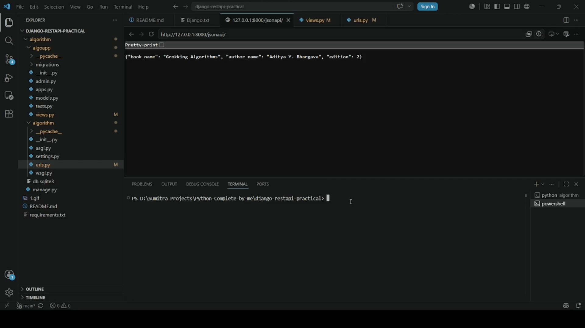
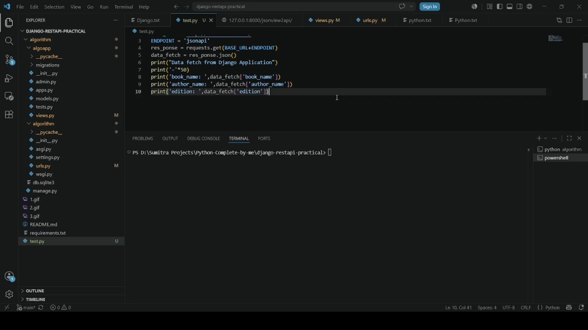

# Django REST API Practical

A practical Django project designed to learn the fundamentals of Django and Django REST Framework, including URL routing, function-based views, and serving HTML and JSON responses.

## 🚀 Features

* Django 6.0.6
* Django REST Framework 3.17.1
* django-filter 25.2
* Basic URL routing
* Function-based views
* HTML response using `HttpResponse`
* JSON response using Python's `json` module
* API testing using HTTPie
* JSON view using JsonResponse
* Communication between Django and Python using JSON

## 📂 Project Structure

```text
algorithm/
│── manage.py
│── db.sqlite3
│
├── algorithm/
│   ├── settings.py
│   ├── urls.py
│   ├── asgi.py
│   ├── wsgi.py
│   └── __init__.py
│
├── algoapp/
│   ├── migrations/
│   ├── admin.py
│   ├── apps.py
│   ├── models.py
│   ├── tests.py
│   ├── views.py
│   └── __init__.py
│
├── README.md
├── requirements.txt
└── test.py
```

## ⚙️ Installation

Clone the repository:

```bash
git clone https://github.com/Sumitra29/django-practical.git
```

Navigate to the project directory:

```bash
cd django-practical/algorithm
```

Install the required packages:

```bash
pip install -r requirements.txt
```

## ▶️ Run the Development Server

```bash
python manage.py runserver
```

Open your browser:

```text
http://127.0.0.1:8000/api/
```

## 📌 Available Endpoint
 
| Method | Endpoint              | Description                                            |
| ------ | --------              | ------------------------------------------------------ |
| GET    | `/api/`               | Returns algorithm book information as an HTML response |
| GET    | `/jsonapi/`           | Returns algorithm book information as a JSON response  |
| GET    | `/jsonview2api/`      | Returns algorithm book information as a JSON response  |

## 🧪 Testing with HTTPie

```bash
http http://127.0.0.1:8000/api/
http http://127.0.0.1:8000/jsonapi/
```

## 🛠 Technologies Used

* Python
* Django 6.0.6
* Django REST Framework
* SQLite

## Django REST-API using HTML
<p align="center">
  
</p>
<p align="center">
  <em>Django REST-API using HTML</em>
</p>

## Django REST-API using JSON Module
<p align="center">
  
</p>
<p align="center">
  <em>Django REST-API using JSON Module</em>
</p>

## Testing the JSON API with HTTPie
<p align="center">
  
</p>
<p align="center">
  <em>Testing the JSON API with HTTPie</em>
</p>

## Json View using django
<p align="center">
  
</p>
<p align="center">
  <em>Json View using django</em>
</p>

## Creating Communication between Django app and Python using JSON
<p align="center">
  
</p>
<p align="center">
  <em>Creating Communication between Django app and Python using JSON</em>
</p>

## 👨‍💻 Author

**Sumitra**
